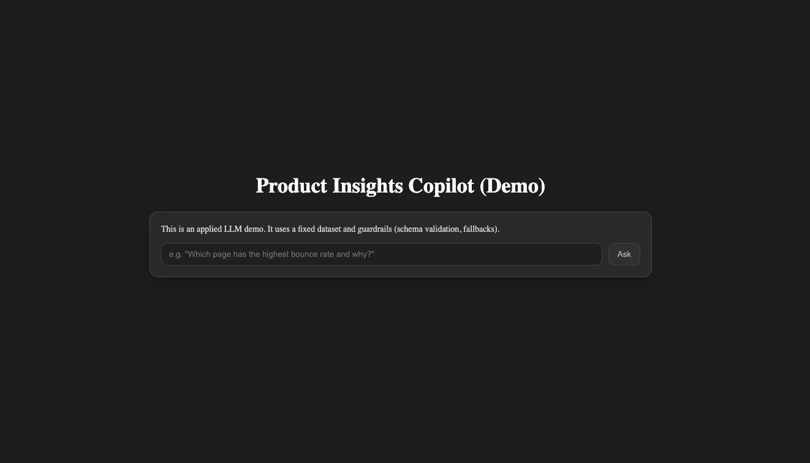

# Product Insights Copilot

An applied LLM demo for product analytics Q&A with **strong guardrails**, **pluggable LLM providers** (OpenAI / Ollama),
and **safe fallbacks**.

> The system answers questions **only from a fixed analytics dataset** and never hallucinates metrics.



---

## Features

- **Provider switch via env** (`LLM_PROVIDER=openai|ollama`)
- **Explicit demo mode** (`DEMO_MODE=true`)
- **Schema validation** end-to-end (shared Zod schemas)
- **Safe fallback behavior** (optional demo fallback)
- **Fastify API** + **Vite/React UI**
- **Docker + docker-compose** support
- **Makefile** helpers for common tasks

---

## Repo structure

This reflects the repo layout you shared (excluding ignored folders like `node_modules/` and build outputs):

```text
.
├─ apps/
│  ├─ api/
│  │  ├─ src/
│  │  │  ├─ __tests__/
│  │  │  ├─ data/
│  │  │  ├─ llm/
│  │  │  │  ├─ askCopilot.ts
│  │  │  │  └─ ollamaClient.ts
│  │  │  ├─ app.ts
│  │  │  └─ server.ts
│  │  ├─ .env.example
│  │  ├─ Dockerfile
│  │  ├─ package.json
│  │  └─ tsconfig.json
│  └─ web/
│     ├─ public/
│     ├─ src/
│     │  ├─ assets/
│     │  ├─ test/
│     │  ├─ App.tsx
│     │  ├─ App.test.tsx
│     │  ├─ main.tsx
│     │  └─ setup.ts
│     ├─ .env.example
│     ├─ Dockerfile
│     ├─ package.json
│     ├─ tsconfig.json
│     ├─ tsconfig.app.json
│     ├─ tsconfig.node.json
│     └─ vite.config.ts
├─ packages/
│  └─ shared/
│     ├─ src/
│     │  └─ index.ts
│     ├─ package.json
│     └─ tsconfig.json
├─ docs/
│  ├─ ARCHITECTURE.md
│  ├─ SCHEMA.md
│  └─ images/
│     └─ ui-demo.png
├─ Makefile
├─ docker-compose.yml
├─ pnpm-workspace.yaml
├─ package.json
├─ CONTRIBUTING.md
├─ SECURITY.md
└─ LICENSE
```

---

## Quickstart (local dev)

### Prereqs

- Node.js (recommend latest LTS)
- pnpm
- (Optional) Docker Desktop / Docker Engine
- (Optional) Ollama (for local LLM)

### Install

From repo root:

```bash
pnpm install
```

### Run API + Web (dev)

In two terminals:

```bash
make dev-api
```

```bash
make dev-web
```

- API: `http://localhost:8080/health`
- Web: `http://localhost:5173`

---

## Environment setup

Create:

- `apps/api/.env` from `apps/api/.env.example`
- `apps/web/.env` from `apps/web/.env.example`

### API env (`apps/api/.env`)

Common:

```bash
PORT=8080
ALLOWED_ORIGINS=http://localhost:5173
DEMO_MODE=false

# Choose provider:
LLM_PROVIDER=openai
# LLM_PROVIDER=ollama

# Optional: only fallback if you explicitly want it
FALLBACK_PROVIDER=demo

# Optional:
LLM_TIMEOUT_MS=15000
```

OpenAI:

```bash
OPENAI_API_KEY=your_key_here
OPENAI_MODEL=gpt-4o-mini
```

Ollama:

```bash
OLLAMA_BASE_URL=http://127.0.0.1:11434
OLLAMA_MODEL=llama3.1:8b
```

### Web env (`apps/web/.env`)

```bash
VITE_API_BASE=http://localhost:8080
```

---

## Providers

### OpenAI (hosted)

Requires an API key + billing/quota on your OpenAI account.

### Ollama (local, free)

Install on macOS:

```bash
brew install ollama
```

Start:

```bash
ollama serve
```

Pull model:

```bash
ollama pull llama3.1:8b
```

---

## Testing

Run all workspace tests from repo root:

```bash
pnpm -r test
```

Or:

```bash
make test
```

---

## Docker

Build:

```bash
make docker-build
```

Run:

```bash
make docker-up
```

Stop:

```bash
make docker-down
```

Logs:

```bash
make docker-logs
```

---

## Docs

- Architecture: `docs/ARCHITECTURE.md`
- Schemas: `docs/SCHEMA.md`

---

## License

MIT — see `LICENSE`.
